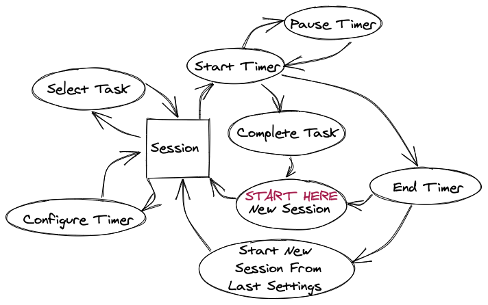
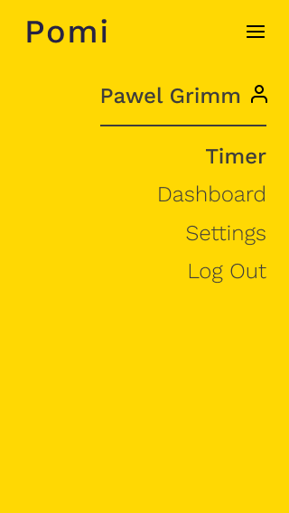
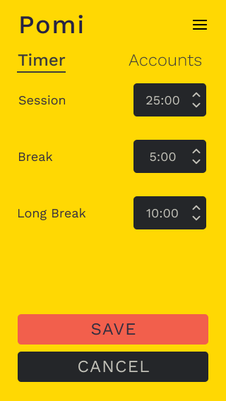
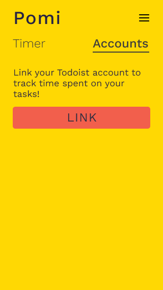

---

# Pomi
Functional Specification

Version 1.0

Pawel Grimm

Last Updated: September 23, 2020

---
# Overview
Pomi is a web application that allows users to track and log their time using the Pomodoro technique (see [Pomodoro Technique](https://francescocirillo.com/pages/pomodoro-technique
)). The main goals are as follows:

1.	Provide an intuitive and easy-to-use interface
2.	Integrate with [Todoist API](https://developer.todoist.com/sync/v8/) to link timer sessions with tasks 
3.	Allow reports to be generated based on time tracking data
4. Allow users to estimate how long tasks will take and compare to actual time taken

**This spec is not, by any stretch of the imagination, complete.** All of the wording will need to be revised several times before it is finalized. The graphics and layout of the screens is shown here merely to illustrate the underlying functionality. The actual look and feel will be developed over time with the input of graphics designers and iterative user feedback.

# Features

 - [x] Web client
 - [x] Start/stop timer and log session to DB
 - [x] Edit session after logging
 - [x] View list of sessions (with links to edit)

# Scenarios
### Scenario 1: Sarah
Sarah is a busy support engineer that wears many different hats. She is responsible for 3 customers, manages 6 engineers, and leads a workgroup. She wants to make sure she is spending her time effectively. She uses the Pomodoro technique to pace herself and write down how she spent each session. However, she doesn't have a great way to get a bird's eye view of how her time is being spent over the course of weeks or months. Pomi will allow her to analyze his time and spend it more effecively.

### Scenario 2: Lucas
Lucas is a junior software developer that struggles to spend his time productively. He works on what he wants to instead of what he has to and is really bad at estimating how long things will take. Like, really bad. Pomi will help him choose tasks from a Todoist project, estimate how long he thinks something will take him, and track how long each task actually took to complete. Over time, this will allow him to complete more work and provide better time estimates.

# Non Goals
This version will not support the following features:

 - [ ] Desktop notifications
 - [ ] Viewing a report of time spent
 - [ ] Logging an estimated time for a task
 - [ ] Todoist integration (associate session with task or project)
 - [ ] Completing linked tasks
 - [ ] Tracking session and break overflow
 - [ ] Splitting a session between multiple tasks
 - [ ] Prompting user to take a long break
 - [ ] Mobile notifications
 - [ ] Audible alarm tone
 - [ ] Offline mode

# Flowchart

*Figure 1. Pomi State Diagram*

# Screen-by-Screen Specification

## Main Screens

*Figure 2. New Session*

*Figure 3. Timer In Progress*

## Menu

*Figure 4. Menu*

## Settings

*Figure 5. Timer Settings*

*Figure 6. Account Settings (Linked)*

*Figure 7. Confirmation Modal when unlinking account*

*Figure 8. Account Settings (Unlinked)*

