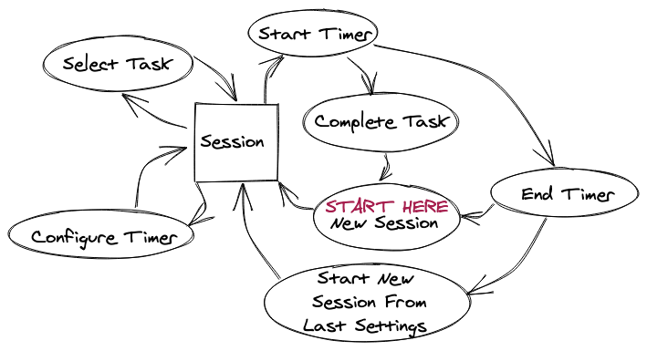

# Pomi

**Functional Specification**

Version 1.0

Authored by Pawel Grimm

Last Updated: November 6, 2020

## Contents

 - [Overview](#overview)
 - [Features](#features)
 - [User Scenarios](#user-scenarios)
 - [Non-Goals](#non-goals)
 - [State Diagram](#state-diagram)
 - [Screen-by-Screen Specification](#screen-by-screen-specification)

# Overview
Pomi is a web application designed for tracking time spent using a timeboxing methodology (e.g. [Pomodoro Technique™][Pomodoro]). 

The main goals are as follows:

1.	Provide an intuitive and easy-to-use interface timer interface
2. Allow users to create and search projects and tasks and/or integrate with projects and tasks from [Todoist](https://developer.todoist.com/sync/v8/) 
3. Link work sessions with projects and tasks 
3. Provide a reporting solution for analyzing productivity
4. Allow users to estimate how long tasks will take and compare to actual time taken

**This spec is not, by any stretch of the imagination, complete.** All of the wording will need to be revised several times before it is finalized. The graphics and layout of the screens is shown here merely to illustrate the underlying functionality. The actual look and feel will be developed over time with the input of graphics designers and iterative user feedback.

# Features

 - [x] Web client
 - [x] Configurable timer
 - [x] Logging work sessions to database
 - [x] Searching for tasks and projects and linking them to work sessions
 - [x] Creating and editing projects and tasks
 - [x] Viewing and filtering logged sessions
 - [x] User authentication
 - [x] Native notifications

# User Scenarios
### Scenario 1: Sarah
*Sarah is a busy support engineer that wears many different hats. She is responsible for customer success across her 3 clients, manages 6 engineers, and leads a workgroup. She wants to make sure she is spending her time effectively. She uses the Pomodoro technique to pace herself and track work that she's completed. However, she doesn't have a great way to get a bird's eye view of how her time is being spent over the course of weeks or months. Pomi will allow her to analyze his time and spend it more effecively.*

### Scenario 2: Lucas
**Note:** This has been de-scoped from v1 and will be adress in the next major release (v2).

*Lucas is a junior software developer that struggles to spend their time productively. They work on what they want to instead of what they have to and they're really bad at estimating how long things will take. Like, really bad. Pomi will help them choose tasks from a Todoist project, estimate how long they thinks something will take them, and track how long each task actually took to complete. Over time, this will allow them to complete more work and provide better time estimates.*

# Non-Goals
This version will not support the following features:

 - [ ] Logging an estimated time for a task
 - [ ] Todoist integration (associate session with task or project, automatically complete linked tasks)
 - [ ] Splitting a session between multiple tasks
 - [ ] Prompting user to take a long break
 - [ ] Offline mode

# State Diagram

*Figure 1. Pomi State Diagram*

# Screen-by-Screen Specification

## Main Screens

*Figure 2. New Session*

*Figure 3. Timer In Progress*

## Menu

*Figure 4. Menu*

## Settings

*Figure 5. Timer Settings*

*Figure 6. Account Settings (Linked)*

*Figure 7. Confirmation Modal when unlinking account*

*Figure 8. Account Settings (Unlinked)*

[Pomodoro]: https://francescocirillo.com/pages/pomodoro-technique